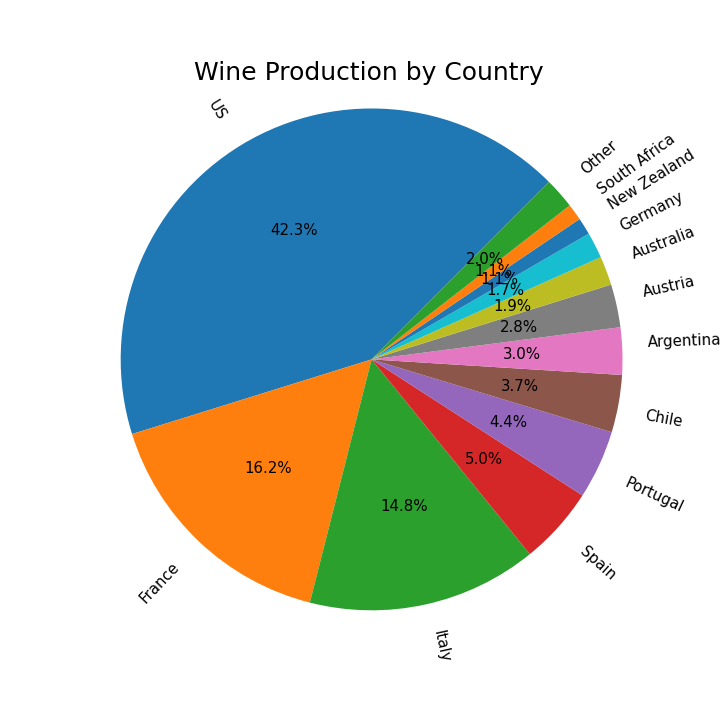
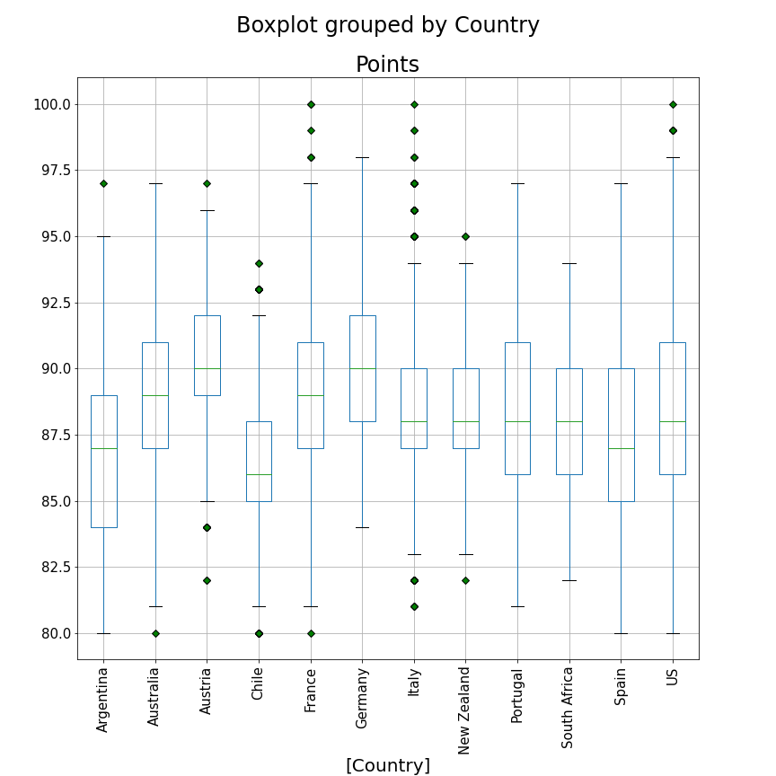
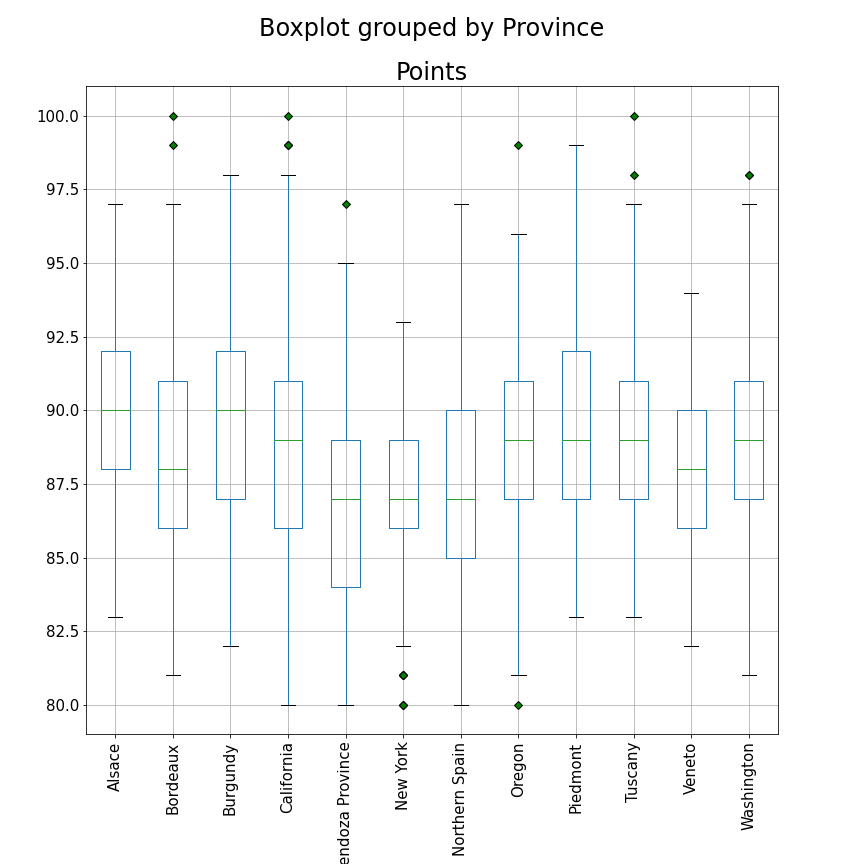

# Predicting Wine ratings

With this project, I am trying to build a model to predict wine ratings. The 100-point wine-scoring scale was popularized by Wine Spectator magazine and by Robert Parker in his Wine Advocate newsletter. There are many who question the value of the 100-point scale, typically because almost all wines evaluated fall within a narrow band between 85 and 100 points. The system is based on the American high-school marking system, so the scale starts at 50 (rather than 0), which has led to further criticism. Despite this the 100-point scale is used by more and more critics – amateur and professional.

Score	Explanation
95–100	Classic: a great wine
90–94	Outstanding: a wine of superior character and style
85–89	Very good: a wine with special qualities
80–84	Good: a solid, well-made wine
75–79	Mediocre: a drinkable wine that may have minor flaws
50–74	Not recommended

## Exploring The Data

The data was obtained from data.world. Originally it was obtained from Tableau as they used it for promo on 2019.1 release

The dataset can be found [here](https://data.world/markpowell/global-wine-points).

The dataset had 12 features and 24,997 observations. 

| COLUMN NAME   | TYPE          | DESCRIPTION                                              |
| ------------- |:-------------:| --------------------------------------------------------:|
| vintage       | date          | Year that the grapes were harvested                      |
| country       | string        |                                                          |
| county        | string        |                                                          |
| designation   | string        |                                                          |
| points        | integer       | 95-100 Classic: a great wine                             |
|               |               | 90-94 Outstanding: a wine of superior character and style|
|               |               | 85-89 Very good: a wine with special qualities           |
|               |               | 80-84 Good: a solid, well-made wine                      |
|               |               | 75-79 Mediocre: drinkable wine that may have minor flaws |
|               |               | 50-74 Not rated                                          |
| price         | decimal       | Price per bottle in USD                                  |
| province      | string        |                                                          |
| State         | string        |                                                          |
| title         | string        | Wine label, brand                                        |
| variety       | string        | Variety of grape                                         |
| winery        | string        |                                                          |

The data was collected from 37 countries and 9000 wineries with 450 different varieties of grapes. The price range for wines were $4 to $780. Though points were on 100 point scale, all the points were ranked between 80 and 100.  

Here are some of the features that seem to have co-relation to the points. 

The dataset had 3 numerical features and 7 categorical. After converting select features into numerical and cleaning up null values, final dataset was 24,989 rwos and 10,773 clolumns.

## Modeling

To prep for modeling, I split my data into a train (80%) and test (20%) set so that I would have some data to test my winning model on that it had not seen before. I chose to compare three types of models: Random Forest Regressor, Ridge, XG Boost and KNN. 
The highest resulting AUC ROC scores for the three model types were:

| Model         | RMSE          | Execution Time                   |
| ------------- |:-------------:| --------------------------------:|
| Base          | 3.03          | with mean of points as target    |
|               |               |                                  |
| Random Forest | 2.16          | 232.5 seconds                    |
|               |               |                                  |
| Ridge         | 2.37          | 69.5 seconds                     |
|               |               |                                  |
| XG Boost      | 2.22          | 22.5 seconds                     |
|               |               |                                  |
| KNN           | 2.61          | 99.6 seconds                     |

My winning model was a Random Forest Regressor; XG Boost was a close second with execution speed 11 times that of RF model.  

## Next Steps

- Try Classification Models

## Main Python Libraries

- pandas
- numpy
- matplotlib
- sklearn
  - RandomForestRegressor
  - Ridge
  - KNN
  - OneHotEncoder
- XG Boost

## Code Files

- wine_rating_data_load_n_EDA.ipynb : Load wine data and perform EDA
- wine_rating_models_final.ipynb : Build and test different models
